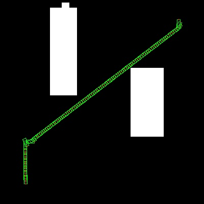
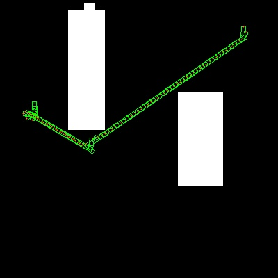
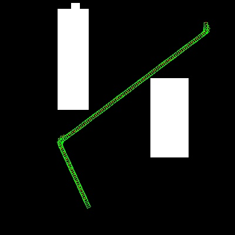
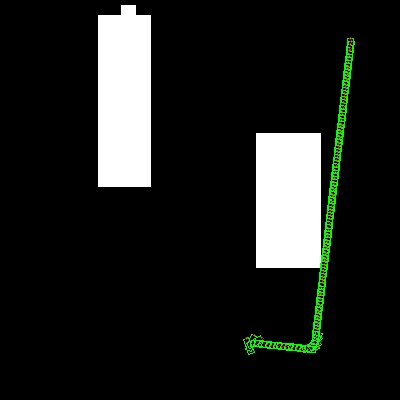

### Description
- this repo is implementation of hybrid-atar-planner for reeds-shepp car, it support to plan drivable path for carlike robot, and take the obstacle avoidance into account.

### Depends
- opencv, use it to store map data and visulization
- glog, use it to logging debug info
- you can easily remove dependancy from both opencv and glog

### Usage
- ```mkdir build && cd build && cmake .. && make```
- set parameter in map/param.cfg map/map_info.cfg map/car_info.cfg
- ```./hybrid_astar_planner ../map/param.cfg```

### examples






### Difference with original hybrid-astar-planner
- use direct 2d heuristic instead of holonomic--with-obstacle heuristic, I found it faster to do so.
- enable analytic expantion all the time not only near the destination.
- both of above can be modified easily.


### Todo
- make it escape dead end faster